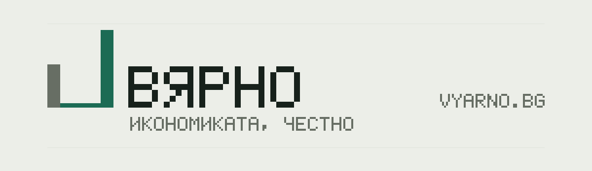
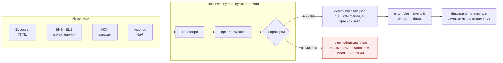

[](https://vyarno.bg)

Безплатен калкулатор с отворен код, който мери официалната статистика на
България спрямо числата на едно домакинство — сметнато в браузъра на читателя,
с източник и дата на всяка стъпка.

Български · **[English](./README.md)**

[](./LICENSE)
[](./pipeline/pyproject.toml)
[](./site/package.json)
[](./site/package.json)
[](https://github.com/vyarno-bg/vyarno/actions/workflows/ci.yml)

<!-- The CI badge renders only for a reader who can see the repository, so it
     went in with the move to vyarno-bg rather than before it. The path is the
     one `legal-nav.js` declares, and `verify_legal.mjs` fails if the two ever
     disagree — it is the same owner string the shipped legal documents
     interpolate. Keep this row identical in README.md and README.bg.md. -->

Официалната инфлация е средно число за кошница, която не е твоята. Ако плащаш
наем, или караш кола всеки ден, или по-голямата част от заплатата ти отива за
храна, публикуваното число може да е доста далеч от това, което годината
всъщност ти струва. Вярно взима същите официални серии на Евростат, от които е
сметнато и официалното число, претегля ги по твоето харчене — и продължава
нататък, през заплатата ти, данъка, наема и цената на един дом. На всяка стъпка
показва сметката и източника.

> Личните ти числа не напускат устройството ти. Всяко публикувано число има
> източник и дата; всеки ред от кошницата — 13-те групи на Евростат и ~46-те
> подгрупи под тях — води към официалната серия, от която е взето.

## Първи стъпки

Току-що клонирано хранилище се сглобява само с публични зависимости — няма
частен регистър, няма лицензен ключ, няма скрита стъпка.

```bash
git clone https://github.com/vyarno-bg/vyarno.git && cd vyarno

cd pipeline && python3 -m venv .venv && source .venv/bin/activate
pip install -r requirements-dev.txt && pip install -e . --no-deps
pytest -q                                     # тестовете, без интернет

cd ../site && npm install && npm run dev      # http://localhost:5173
```

Под Windows виртуалната среда държи изпълнимите файлове в `Scripts\`, а
интерпретаторът се казва `python`, не `python3`: `python -m venv .venv`, после
`.\.venv\Scripts\Activate.ps1` — останалото е същото. CI покрива Linux и
Windows;
[`docs/local-development.md`](./docs/local-development.md) §„On Windows“ дава
пълния списък команди и шестте неща, на които стъпва.

Сайтът чете JSON файловете, които вече са в `data/published/`, така че работи,
без изобщо да вика външно API. За да пуснеш всичко, което пуска и CI — двата
набора тестове, линтерите, продукционния билд и теста в браузър — използвай
`make check` от корена на хранилището (`make help` изброява целите) или
`cd site && npm run check:all`, което пуска същото на машина без `make`.


Нищо тук не е финансов, инвестиционен, данъчен, правен или кредитен съвет, и
никое от числата не е препоръка.

## Какво смята

Осем въпроса, от една нетна заплата и една кошница:

| Въпрос | Как се отговаря |
|---|---|
| **Какво направиха цените с _мен_?** | Твоята кошница срещу официалната — 13-те групи по ECOICOP, с разбивка до ~46-те подгрупи под тях. Всеки ред води към серията на Евростат, от която е взет |
| **Изпревари ли увеличението ми цените?** | Реалната заплата: увеличението, което си получил, срещу инфлацията, която твоята кошница наистина е видяла — като съотношение и в евро на месец |
| **Къде съм по заплата?** | Подредба на брутните заплати в 11 стъпки, от P1 до P99 — формата на разпределението е от изследване на Евростат, а нивото е изравнено по последната средна заплата на НСИ. Класацията не следва твоята област: никой не публикува как са разпределени заплатите вътре в една област |
| **Как стои заплатата ми в моята дейност?** | Разстоянието до средната заплата, която НСИ публикуват за избраната от теб дейност по КИД-2008, нето срещу нето. **Средна, а не класация** — никой не публикува как са разпределени заплатите вътре в един сектор у нас, затова картата го казва и показва колко над средата стои една средна стойност |
| **Колко наистина взима «плоският» данък?** | Данъчният клин, ефективен и пределен, от датираната таблица на осигурителното законодателство. Данъкът е плосък; удръжките не са, защото осигуровките спират на таван, а данъкът — не. И двете числа излизат от публикуваните ставки и публикувания таван |
| **Колко ми струва наемът?** | Наемът като дял от нетната заплата и до коя дата в месеца работиш само за наема |
| **Какво губят спестяванията ми?** | Обезценяване на кеша по _твоята_ инфлация, не по официалната |
| **Колко далеч е един дом?** | Анюитет по лихвата на ЕЦБ за нови кредити, в рамките на ограниченията на БНБ (LTV, DSTI, максимален срок), срещу цените €/м² в твоя град — с праг на достъпност, който съзнателно държим строг: 30% от нетния доход |

## Защо може да го провериш

Не защото го казваме ние. Защото можеш да го провериш:

- **Всяко число води към източника си.** До всяка група стои стрелка «↗», която
  отваря точно тази серия в Евростат — не общата таблица, а извадката с числото,
  което виждаш.
- **Всяко число носи дата.** Не «актуално към днес», а датата, на която самият
  източник го е публикувал. Когато нашата дата и датата на източника се
  различават, пише коя от двете е на екрана.
- **Липсващото число се показва като липсващо.** Ако някой файл с данни не се
  зареди, страницата не подменя числото с правдоподобно — казва, че го няма.
  Грешните данни са безкрайно по-лоши от липсващите данни, и целият проект е
  построен около това изречение.
- **Сметките са отворени.** Кодът, който смята, е тук и е писан, за да се
  [чете](./site/src/lib/mirror.js); как точно се получава всяко число е описано
  в [`docs/math.md`](./docs/math.md).
- **Нищо не се крие зад плащане.** Няма регистрация, няма платена версия, няма
  функция, запазена за по-късно.

## Откъде идват числата

| Източник | Какво дава |
|---|---|
| **Евростат** | ХИПЦ — инфлацията по 13 групи и ~46 подгрупи, теглата на официалната кошница, индексите по години и формата на разпределението на заплатите. Плюс пазара на жилища: колко жилища купуват домакинствата всяко тримесечие, колко плащат за тях, индексът на цените, собствеността и жилищният фонд от преброяването |
| **ЕЦБ / БНБ** | лихвите по нови жилищни кредити, ГПР, ограниченията на БНБ за ипотеки (LTV, DSTI, максимален срок) |
| **НСИ** | средната работна заплата във всяка от 28-те области и средната работна заплата по икономически дейности — 19 раздела по КИД-2008 плюс общата за всички дейности, която е нивото, по което е изравнена подредбата на заплатите. С имената на самите НСИ |
| **имот.bg** | средни цени €/м² по квартали, в 27-те града, за които публикуват |

До тях стоят две датирани таблици, които се поддържат в хранилището, а не се
свалят: българското осигурително и данъчно законодателство (ставките и
осигурителният таван) и кредитните ограничения на БНБ. И двете носят датата, на
която са прочетени.

**Втора страница, [`/market/`](https://vyarno.bg/market/), чете данните за
жилищния пазар.** На нея няма нито едно поле за въвеждане: това е пазарът така,
както го публикуват институциите — под всяко число пише кой го публикува, за кой
период е и къде да се провери, а където сметката е наша, пише че е наша, как е
направена и стои връзка към заявката, която я връща. Страницата не заема страна:
числата на нея сочат в различни посоки и всички са показани.

## Как е устроено

**Данните се вграждат при сглобяването, а сайтът е статичен**: няма ограничения
от чужди API, работи и офлайн, а датата, към която се отнасят числата, е честна.
Браузърът на читателя никога не вика Евростат, а всяко публикувано число носи
произхода си.



Проверките не са техническа подробност, а смисълът на цялата верига: **грешните
данни са безкрайно по-лоши от липсващите данни**, така че обновяване, което не
може да се докаже, не публикува нищо, а сайтът продължава да показва предишните
числа с истинската им дата. Какво проверява всяка от тях и какво да правиш, когато някоя не мине, е в
[`docs/validation-gates.md`](./docs/validation-gates.md). Цялата карта е в
[`docs/architecture.md`](./docs/architecture.md).

## Технологии

Доверието към проекта стъпва на това, че може да бъде проверен, затова стекът е
малък, а версиите са тези от манифестите, а не пожелания.

| Слой | Технология | Версия |
|---|---|---|
| **Конвейер** | Python | 3.11 (CI фиксира `3.11`) |
| | httpx · pydantic · click · openpyxl | ≥0.27 · ≥2.6 · ≥8.1 · ≥3.1 |
| | pytest · pytest-cov · hypothesis · respx · ruff | ≥8.0 · ≥4.1 · ≥6.95 · ≥0.21 · ≥0.16 |
| **Сайт** | Node | 22 (CI фиксира `22`) |
| | Svelte · Vite · `@sveltejs/vite-plugin-svelte` | ^5.56.8 · ^8.1.5 · ^7.2.0 |
| | ESLint · Prettier · svelte-check · TypeScript | ^10.8.0 · ^3.9.6 · ^4.7.4 · ^6.0.3 |
| | Playwright | ^1.62.0 |

Интересното е това, което го няма:

- **Сайтът няма зависимости по време на работа.** `site/package.json` не обявява
  нито една `dependencies` — всичко е `devDependency`. Три от тях сглобяват
  приложението (`svelte`, `@sveltejs/vite-plugin-svelte`, `vite`); останалите го
  проверяват, типизират или управляват браузър. Това, което се качва, е
  компилираният изход на Svelte.
- **Сайтът няма тестова рамка.** Наборът му върви на `node:test`, вграден в
  Node. Конвейерът използва pytest — стандартът в Python.
- **Страницата зарежда един-единствен чужд файл и списъкът е затворен.** Брояч
  на посещенията, който не поставя бисквитка, не записва нищо в браузъра и не
  пази отпечатък по-дълго от 24 часа — описан в собствен раздел на политиката
  за поверителност. Освен него няма скрипт от CDN, няма шрифт от чужд сървър и
  няма пиксел. Шрифтовете се зареждат от нашия домейн — собствените файлове на
  IBM и Adobe, вградени без никаква промяна и никога орязвани тук, защото и
  двете семейства носят запазено име, а OFL 1.1 смята орязването до
  подмножество за промяна (`NOTICE`). Политиката CSP в `site/public/_headers`
  изброява двата адреса поименно, а `verify_static_assets.mjs` пада при трети —
  това прави затворения списък проверим, а не просто заявен.

Какво се проверява и с какво:

| Набор | Пуска | Какво пази |
|---|---|---|
| `pytest` в `pipeline/` | без интернет | Конекторите, преобразуванията, седемте проверки, публикуваните файлове |
| `node:test` в `site/` | без браузър | Всяка формула, всяка производна стойност, инвариантите на текста, правните твърдения, контраста по WCAG, HTTP заглавките |
| `node:test` + Playwright | в браузър | Готовата страница, заредена в истински браузър — единственият набор, който пуска самото приложение |

`make check` пуска всичко в реда на CI и отчита колко теста е преброил всеки
набор. Числата живеят в този отчет и в `site/scripts/check-test-floors.mjs`,
който се проваля, когато някой набор се върне по-малък, отколкото е бил — брой,
записан тук, е брой, който нищо не проверява, а читателят не може да различи
остарял от текущ.
[`docs/testing-strategy.md`](./docs/testing-strategy.md) казва в кой набор
принадлежи един тест и какво съзнателно остава непокрито. Няма праг за покритие,
и това е нарочно.

## Какво има в хранилището

| Път | Какво |
|---|---|
| `docs/` | **[Започни оттук](./docs/README.md)** — входната точка за разработчика: архитектура, източници, математика, проверки, локална разработка, устройство на сайта и в кой набор принадлежи един тест |
| `pipeline/` | Python 3.11. Сваля данните от Евростат / БНБ / ЕЦБ / имот.bg / НСИ, плюс датираните таблици на осигурителното законодателство и кредитните ограничения, зад проверките. CLI: `vyarno-pipeline refresh --source <name>`. Пише дванадесет JSON файла в `data/published/` |
| `data/published/` | Публикуваните числа, с версия. Заредени в хранилището. Сайтът чете тях и никога не вика външно API. **Тези числа не са наши — виж [Лиценз](#лиценз)** |
| `site/` | Vite 8 + Svelte 5. Три страници — калкулаторът, `/legal/` и 404. Сглобява се в статична директория |
| `.github/workflows/ci.yml` | Двата набора тестове и продукционният билд, при всеки push към всеки клон и при всеки pull request. Не обновява данните |

Обяснението на човешки език — какво е Евростат и защо на числата може да се
вярва — е в [`docs/how-it-works.md`](./docs/how-it-works.md).

## Как да го пуснеш и къде да го качиш

Вярно е две неща: статичен билд и конвейер, който пускаш по график, какъвто
решиш. `npm run build` произвежда `site/dist/` — директория с файлове без нищо
сървърно; всеки статичен хостинг ще се справи с нея. `site/public/_headers` е
политиката за сигурност и кеширане, която внедряването трябва да приложи —
независимо дали хостингът чете този формат директно, или ти го превеждаш на
синтаксиса на своя сървър.

**Как хостваш и автоматизираш е твое решение.** Това хранилище описва кода, а не
машината на един оператор.

```bash
cd pipeline && source .venv/bin/activate
vyarno-pipeline refresh --source all --out ../data/published
```

Това записва дванадесетте JSON файла и не комитва нищо — прегледът е самият diff, а
файл, който никой не е погледнал, е число, което никой не е проверил. Всеки
`--source` може да се пусне сам; `vyarno-pipeline refresh --help` ги изброява.

**Как да разбереш, че обновяването е закъсняло.** Всеки файл носи ритъма на
източника, от който идва — месечен за ХИПЦ и лихвата на ЕЦБ, тримесечен за
заплатите на НСИ, годишен за осигурителната таблица, веднъж на четири години за
изследването на заплатите на Евростат
([`site/src/lib/payloads.js`](./site/src/lib/payloads.js)) — и всеки се мери
спрямо своя собствен. След срока си файлът е «предстои обновяване», а след 1,5
пъти срока е «закъснял» и сайтът показва лента, която казва колко са
закъснелите. Няма един общ праг за целия сайт, защото едно число не може да
обслужи четири различни ритъма: 45 дни са закъснение за месечна серия, напълно
нормални за тримесечна и без всякакво значение за изследване, което се прави
веднъж на четири години.

Заглавната лента отваря списък с всичките дванадесет — периодът, за който се отнася
всяко число, денят, в който сме го изтеглили, и връзка към първоизточника. Двете
дати са различни (числата за юни, изтеглени на 27 юли), и точно тук престават да
се сливат в една.

`/version.json` на качен сайт носи същите дати за всеки файл, двете обобщени
дати и комита, от който е сглобен, така че една HTTPS заявка отговаря и на «кой
код е жив», и на «колко старо е всяко число»:

```json
{"commit":"a1b2c3d","built_at":"2026-08-01T09:12:33Z",
 "data":{"oldest_as_of":"2026-07-23","newest_as_of":"2026-07-27",
         "payloads":{"hicp_headline":"2026-07-27","city_price":"2026-07-23"}}}
```

`--skip-link-check` е само за среда без изходящ HTTP. Изключва единствената
проверка, която хваща мъртва връзка в публикувания JSON — виж
[`docs/validation-gates.md`](./docs/validation-gates.md), проверка 6.

## Версии и издания

Няма такива, и това е нарочно. Вярно е сайт плюс конвейер за данни, а не
библиотека: никой не го инсталира, нищо не зависи от негова версия и
единственото копие, което има значение, е това, което работи на vyarno.bg. Един
таг би бил число, което никой не чете, за състояние, в което никой не може да
бъде.

Това, което качената страница **носи**, е `/version.json`, записан при билда с
комита, от който идва, и датата `as_of` на данните, вградени в него. Той
отговаря на единствените два въпроса, които някой наистина задава — кой код върви
и колко стари са числата — и не може да остарее, защото билдът го записва.

Ако това се промени (публикуван пакет, документирано API, някой, който зависи от
конкретно състояние на това хранилище), отговорът се променя с него.

## Как да помогнеш

Приносите са добре дошли, а поправките по числата — най-много от всичко. Ако
едно число изглежда сгрешено, това е най-ценният сигнал, който можеш да
подадеш: граждански инструмент, който греши уверено, е по-лош от никакъв
инструмент. По ред на полза:

1. **Съобщи за сгрешено число**, с източника и датата, ако ги имаш.
2. **Съобщи за източник, който е спрял или се е преместил.** Издателите
   преструктурират сайтовете си; мъртъв `source_url` е истински дефект.
3. **Оправи българския.** Сайтът е двуезичен, но българският е основният език.
   Тромава формулировка на български се смята за бъг, а не за дреболия — и това,
   както и първите две, не изисква да си програмист.
4. **Достъпност и четимост** — контраст, навигация с клавиатура, етикети за
   екранни четци.
5. **Код и документация.**

Прочети първо [`CONTRIBUTING.md`](./CONTRIBUTING.md); той описва настройката,
проверките, през които трябва да мине една промяна, и твърдото правило за
източниците: нов източник влиза заедно с условията си за ползване — цитирани
дословно, на оригиналния език, с датата, на която са прочетени.
[`CODE_OF_CONDUCT.md`](./CODE_OF_CONDUCT.md) важи за всяко пространство, което
проектът използва.

## Лиценз

**Кодът е [Apache-2.0](./LICENSE).** Свободен за използване, промяна и
разпространение, с търговска цел или не. Няма двоен лиценз, няма търговско
издание и няма «отворен, но» — лицензът е един и е този.

**Числата в `data/published/` са съзнателно изключение и не са наши.** Те
принадлежат на Евростат, ЕЦБ, БНБ, НСИ и имот.bg, разпространяват се при
условията на всеки от тези издатели поотделно, и всеки файл носи своя
`source_url`. Ние никога не сме имали правото да ги преотстъпваме и лицензът
Apache не претендира, че ги покрива. Ако направиш форк на това хранилище и
разпространяваш числата, условията на източниците пътуват заедно с тях и стават
твое задължение.

Точната граница е в [`NOTICE`](./NOTICE), а условията на всеки издател са
цитирани дословно, на оригиналния език и с датата на последната проверка, в
[`docs/legal.md`](./docs/legal.md).

«Вярно», «Vyarno» и домейнът vyarno.bg са марки на носителя на авторското право;
Apache-2.0 §6 не дава разрешение за използването им. Да кажеш, че работата ти
стъпва на Вярно — това е добре дошло. Само не наричай форка си «Вярно».

Общите условия, съобщението за поверителност и данните за доставчика по ЗЕТ
чл. 4 се публикуват на [vyarno.bg/legal/](https://vyarno.bg/legal/) и се
генерират от `site/src/lib/legal.js`. Нищо в това хранилище не е правен съвет.

## Подкрепа за проекта

Вярно е обществено благо. Всичко е безплатно за всички, няма акаунт, няма
платена версия, няма заключена функционалност и нищо не е запазено за по-късно.
Каквото прави сайтът, го прави за всекиго. Издържа се от дарения — няма
заплати, няма фирма и няма инвеститор. Дарението не купува нищо: нито функции,
нито приоритет, нито влияние върху което и да е публикувано число. Ако
предпочиташ да не даваш, за теб нищо не се променя.

Сайтът казва всичко това и сам, на [vyarno.bg/support/](https://vyarno.bg/support/) —
собствен адрес, а не част от правната страница, за да може да се дава като
връзка.

**[Ko-fi](https://ko-fi.com/vyarno)** — еднократно, без регистрация.
**[GitHub Sponsors](https://github.com/sponsors/vyarno-bg)** — еднократно или
месечно. И двата са обявени в [`.github/FUNDING.yml`](./.github/FUNDING.yml) и
[`site/src/lib/support.js`](./site/src/lib/support.js), където всеки канал има
флаг `live` — връзката не влиза в страницата, преди сметката зад нея да
съществува, защото бутон за дарение, който води към 404, е по-лош от никакъв
бутон. `site/scripts/verify_support.mjs` чупи билда, ако двата файла някога се
разминат, както и ако отворен канал липсва от Поверителност.

Парите обаче не са най-полезната подкрепа: съобщи за сгрешено число, оправи
нещо ([Как да помогнеш](#как-да-помогнеш) е подредено по полза), или просто кажи
на някого, че сайтът съществува. Граждански инструмент, за който никой не знае,
не помага на никого.
