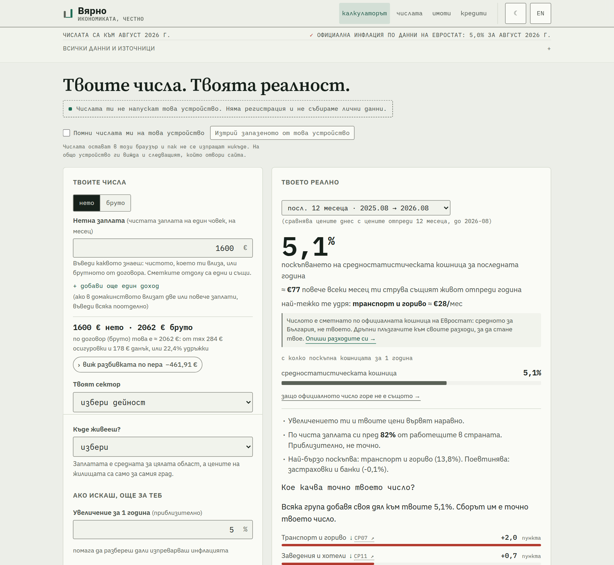
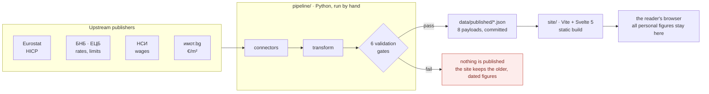

[](https://vyarno.bg)

A free, open-source calculator that measures Bulgaria's official statistics
against one household's own numbers — computed in the reader's browser, sourced
and dated at every step.

**[Български](./README.bg.md)** · English

[](./LICENSE)
[](./pipeline/pyproject.toml)
[](./site/package.json)
[](./site/package.json)
[](https://github.com/vyarno-bg/vyarno/actions/workflows/ci.yml)

<!-- The CI badge renders only for a reader who can see the repository, so it
     went in with the move to vyarno-bg rather than before it. The path is the
     one `legal-nav.js` declares, and `verify_legal.mjs` fails if the two ever
     disagree — it is the same owner string the shipped legal documents
     interpolate. Keep this row identical in README.md and README.bg.md. -->

The official inflation rate is an average over a basket that is not yours. If
you rent, or drive a lot, or spend most of your income on food, the published
number can be quite far from what your year actually cost you. Вярно takes the
same official Eurostat series the headline is built from, re-weights them to
your spending — and then keeps going, through your wage, your tax, your rent
and the price of a home. Every step shows its arithmetic and its sources.

> Your personal numbers never leave your device. Every published figure is
> sourced and dated; every basket row — the 13 Eurostat divisions and the ~46
> groups underneath them — links to the official series it came from.

## Quick start

A fresh clone builds with only public dependencies. No private registry, no
licence key, no vendored blob.

```bash
git clone https://github.com/vyarno-bg/vyarno.git && cd vyarno

cd pipeline && python3 -m venv .venv && source .venv/bin/activate
pip install -r requirements-dev.txt && pip install -e . --no-deps
pytest -q                                     # the offline suite

cd ../site && npm install && npm run dev      # http://localhost:5173
```

On Windows the venv puts its executables in `Scripts\` and the interpreter is
`python`, not `python3`: `python -m venv .venv` then
`.\.venv\Scripts\Activate.ps1`, and the rest is identical. CI covers Linux and
Windows —
[`docs/local-development.md`](./docs/local-development.md) §"On Windows" has the
full block and the six things that make it work.

The site reads the JSONs already committed under `data/published/`, so it runs
without ever touching an upstream API. To run everything CI runs — both suites,
the linters, the production build and the browser smoke test — use `make check`
from the repository root (`make help` lists the targets), or
`cd site && npm run check:all`, which is the same sequence for a machine with no
`make`.



Nothing here is financial, investment, tax, legal or credit advice, and no
figure it produces is a recommendation.

## What it works out

Seven questions, from one net salary and one basket:

| Question | How it is answered |
|---|---|
| **What did prices do to _me_?** | Your own basket re-weighted against the official one — the 13 ECOICOP divisions, with a drill-down into the ~46 groups underneath. Each row links to the Eurostat series it came from |
| **Did my raise beat prices?** | Real wage: the raise you got against the inflation your own basket actually saw, as a ratio and in euro per month |
| **Where does my pay sit?** | An 11-rung gross salary ladder for Sofia, P1 to P99 — distribution shape from a Eurostat survey, level re-set to the latest НСИ average wage |
| **What does the "flat" tax really take?** | The tax wedge, effective and marginal, from the dated payroll table. The tax is flat; the deductions are not, because contributions stop at a ceiling and tax does not. Both figures come from the published rates and the published ceiling |
| **What does rent cost me?** | Rent as a share of net pay, and the day of the month up to which you are working for the landlord |
| **What is cash losing?** | Savings erosion at *your* inflation rate, not the headline one |
| **How far is a home?** | An annuity at the ЕЦБ new-business rate, inside the БНБ lending limits (LTV, DSTI, maximum term), against Sofia €/m² across 143 districts — with affordability held at a deliberately strict 30% of net |

## Why you can check it

Not because we say so — because you can verify it:

- **Every number links to its source.** Beside each category is an «↗» that
  opens exactly that series at Eurostat: not the general table, the extract
  carrying the number on your screen.
- **Every number carries a date.** Not "current", but the date the publisher
  released it. Where our date and the source's differ, the page says which one
  you are looking at.
- **A missing number shows as missing.** If a payload fails to load, the page
  does not substitute something plausible — it says the figure is not there.
  Wrong data is infinitely worse than no data, and the whole project is built
  around that sentence.
- **The arithmetic is open.** The code that computes is here and meant to be
  [read](./site/src/lib/mirror.js); how each figure is derived is written down
  in [`docs/math.md`](./docs/math.md).
- **Nothing is behind a paywall.** No account, no paid tier, no feature held
  back for later.

## Where the numbers come from

| Publisher | What it provides |
|---|---|
| **Eurostat** | HICP — inflation across 13 divisions and ~46 groups, the official basket weights, the yearly indices, and the salary-distribution shape |
| **ЕЦБ / БНБ** | Interest rates on new home loans, APRC, and the БНБ lending limits for mortgages (LTV, DSTI, maximum term) |
| **НСИ** | The average wage for Sofia, and the level the salary ladder is anchored to |
| **имот.bg** | Average €/m² by district in Sofia |

Alongside these sit two dated tables maintained in the repository rather than
fetched: the Bulgarian payroll law (rates and the insurance ceiling) and the
БНБ lending limits. Both carry the date they were read.

## How it fits together

**Build-time data bake plus a static site**: no API throttling, offline-friendly,
honest "as-of" dating. The user's browser never calls Eurostat, and every
published figure carries its provenance.



The gates are the point, not the plumbing: **wrong data is infinitely worse than
no data**, so a refresh that cannot prove itself publishes nothing and the site
keeps serving the previous figures with their real date on them. What each gate
checks, and what to do when one trips, is in
[`docs/validation-gates.md`](./docs/validation-gates.md). The full map is
[`docs/architecture.md`](./docs/architecture.md).

## Technology

The project's credibility rests on being inspectable, so the stack is small and
its versions are the ones in the manifests, not aspirations.

| Layer | Technology | Version |
|---|---|---|
| **Pipeline** | Python | 3.11 (CI pins `3.11`) |
| | httpx · pydantic · click · openpyxl | ≥0.27 · ≥2.6 · ≥8.1 · ≥3.1 |
| | pytest · pytest-cov · hypothesis · respx · ruff | ≥8.0 · ≥4.1 · ≥6.95 · ≥0.21 · ≥0.16 |
| **Site** | Node | 22 (CI pins `22`) |
| | Svelte · Vite · `@sveltejs/vite-plugin-svelte` | ^5.56.8 · ^8.1.5 · ^7.2.0 |
| | ESLint · Prettier · svelte-check · TypeScript | ^10.8.0 · ^3.9.6 · ^4.7.4 · ^6.0.3 |
| | Playwright | ^1.62.0 |

The interesting entries are the ones that are not there:

- **The site has no runtime dependencies.** `site/package.json` declares no
  `dependencies` at all — every entry is a `devDependency`. Three of them build
  the app (`svelte`, `@sveltejs/vite-plugin-svelte`, `vite`); the rest lint it,
  type-check it or drive a browser. What ships is Svelte's compiled output.
- **The site has no test framework.** Its suite runs on `node:test`, built into
  Node. The pipeline uses pytest, Python's standard.
- **The page loads nothing third-party.** No CDN script, no hosted font, no
  analytics pixel. Fonts are self-hosted — IBM's and Adobe's own builds,
  vendored byte for byte and never re-subset here, because both families carry
  a Reserved Font Name and OFL 1.1 counts subsetting a webfont as modification
  (`NOTICE`). The CSP in `site/public/_headers` is what makes the
  nothing-third-party claim checkable rather than merely intended.

What is verified, and by what:

| Suite | Runs | What it protects |
|---|---|---|
| `pytest` in `pipeline/` | offline | Connectors, transforms, the six validation gates, the published payloads |
| `node:test` in `site/` | no browser | Every formula, every derived value, the copy invariants, the legal claims, WCAG contrast, the response headers |
| `node:test` + Playwright | in a browser | The built page, loaded in a real browser — the only suite that runs the app |

`make check` runs all of it in CI's order and reports what each suite counted.
The counts live in that run and in `site/scripts/check-test-floors.mjs`, which
fails when a suite comes back smaller than it was — a number written out here
would be one nothing checks, and a reader cannot tell a stale count from a
current one.
[`docs/testing-strategy.md`](./docs/testing-strategy.md) says which suite a test
belongs in, and what is deliberately left uncovered. There is no coverage
threshold, on purpose.

## What is in the repository

| Path | What |
|---|---|
| `docs/` | **[Start here](./docs/README.md)** — the engineer entry point: architecture, data sources, math, validation gates, local dev, site structure, and which suite a test belongs in |
| `pipeline/` | Python 3.11 ingest from Eurostat / БНБ / ЕЦБ / имот.bg / НСИ, plus dated payroll-law and mortgage-limit tables, behind validation gates. CLI: `vyarno-pipeline refresh --source <name>`. Writes eight JSONs to `data/published/` |
| `data/published/` | Versioned JSONs produced by the pipeline. Committed. The site reads these at runtime and never hits an upstream API. **These figures are not ours to license — see [Licence](#licence)** |
| `site/` | Vite 8 + Svelte 5. Three pages — the calculator, `/legal/` and a 404. Builds to a static directory |
| `.github/workflows/ci.yml` | Both test suites and the production build, on every push to every branch and on every pull request. Does not refresh data |

For the plain-language version — what Eurostat is and why the numbers are
trustworthy — see [`docs/how-it-works.md`](./docs/how-it-works.md).

## Running it, and hosting it

Вярно is two things: a static build, and a pipeline you run on a schedule of
your choosing. `npm run build` produces `site/dist/`, a directory of files with
no server-side component — any static host will serve it. `site/public/_headers`
is the security and cache policy that deployment should apply, whether the host
reads that format natively or you translate it into your server's own syntax.

**How you host and automate it is yours to decide.** This repository describes
the code, not one operator's machine.

```bash
cd pipeline && source .venv/bin/activate
vyarno-pipeline refresh --source all --out ../data/published
```

That writes the eight JSONs and commits nothing — the diff is the review, and a
payload nobody looked at is a number nobody checked. Each `--source` can be run
alone; `vyarno-pipeline refresh --help` lists them.

**How to know a refresh is overdue.** Every payload declares the cadence of the
upstream it comes from — monthly for HICP and the ECB rate, quarterly for the
НСИ wage series, annual for the payroll table, four-yearly for the Eurostat
earnings survey ([`site/src/lib/payloads.js`](./site/src/lib/payloads.js)) — and
each is judged against its own. Past its cadence a payload is *due*; past 1.5×
it is *overdue* and the site raises a banner naming how many are late. There is
no single site-wide threshold, because one number cannot serve four release
rhythms: 45 days is late for a monthly series, perfectly normal for a quarterly
one, and meaningless against a survey that runs every four years.

The strip header opens a panel listing all eight, each with the period its
figures describe, the day we fetched it, and a link to the publisher. Those two
dates are different — June's HICP figures fetched on 27 July — and the panel is
where that stops being collapsed into one.

`/version.json` on a deployed site carries the same per-payload dates plus both
aggregates beside the commit it was built from, so one HTTPS request answers
"which code is live" and "how old is each figure":

```json
{"commit":"a1b2c3d","built_at":"2026-08-01T09:12:33Z",
 "data":{"oldest_as_of":"2026-07-23","newest_as_of":"2026-07-27",
         "payloads":{"hicp_headline":"2026-07-27","sofia_price":"2026-07-23"}}}
```

`--skip-link-check` is for a sandbox with no outbound HTTP only. It turns off
the one gate that catches a dead link in the published JSON — see
[`docs/validation-gates.md`](./docs/validation-gates.md) gate 6.

## Versions and releases

There are none, deliberately. Вярно is a website plus a data pipeline, not a
library: nothing installs it, nothing depends on a version of it, and the only
copy that matters is the one running at vyarno.bg. A tag would be a number
nobody reads describing a state nobody can be on.

What the deployed site *does* carry is `/version.json`, written at build time
with the commit it came from and the `as_of` date of the data baked into it.
That answers the only two questions anyone actually asks — which code, and how
old are the figures — and it cannot go stale, because the build writes it.

If that changes (a published package, a documented API, anyone depending on a
particular state of this repository), the answer changes with it.

## Contributing

Contributions are welcome, and corrections to the numbers most of all. If a
figure looks wrong, that is the highest-value issue you can open — a civic tool
that is wrong is worse than no tool. In order of usefulness:

1. **Report a wrong number**, with the source and the date if you have them.
2. **Report a source that has moved or died.** Publishers restructure their
   sites; a dead `source_url` is a real defect.
3. **Fix the Bulgarian.** The site is bilingual, but Bulgarian is the primary
   language and clumsy phrasing counts as a bug, not a nitpick. You do not need
   to be a programmer for this, or for the two above.
4. **Accessibility and readability** — contrast, keyboard navigation, screen
   reader labels.
5. **Code and documentation.**

Read [`CONTRIBUTING.md`](./CONTRIBUTING.md) first; it covers the local setup,
the validation gates a change has to pass, and the one hard rule about upstream
data sources — a new source arrives together with its terms of use, quoted
verbatim, in the original language, with the date they were read.
[`CODE_OF_CONDUCT.md`](./CODE_OF_CONDUCT.md) applies to every space the project
uses.

## Licence

**The code is [Apache-2.0](./LICENSE).** Free to use, modify and redistribute,
commercially or not. No dual licence, no commercial edition, no
source-available restrictions — there is one licence and this is it.

**The figures in `data/published/` are a deliberate exception.** They belong to
Eurostat, the ЕЦБ, БНБ, НСИ and имот.bg, are redistributed under each
publisher's own terms, and every payload carries a `source_url`. We never held
the right to license those figures out and the Apache grant does not purport to
cover them. If you fork this repository and redistribute the data, those
upstream terms travel with the figures and become yours to honour.

Read [`NOTICE`](./NOTICE) for the exact boundary, and
[`docs/legal.md`](./docs/legal.md) for each publisher's terms quoted verbatim,
in the original language, with the date we last checked them.

"Вярно", "Vyarno" and the domain vyarno.bg are marks of the copyright holder;
Apache-2.0 §6 does not grant permission to use them. Say your work is based on
Вярно — that is welcome. Just do not name your fork "Вярно".

The site's terms of use, privacy notice and the provider identification required
by ЗЕТ чл. 4 are published at [vyarno.bg/legal/](https://vyarno.bg/legal/),
generated from `site/src/lib/legal.js`. Nothing in this repo is legal advice.

## Support this project

Вярно is a public good. Every feature is free to everyone, there is no account,
no paid version, no locked functionality and nothing held back for later. What
the site does is what it does, for everybody. It is sustained by donations —
there are no salaries, no company and no investor. A donation buys nothing: no
features, no priority, no influence over any figure the site publishes. If you
would rather not give, nothing changes for you.

The site says all of this itself, at [vyarno.bg/support/](https://vyarno.bg/support/) —
its own URL rather than a fragment of the legal page, so it can be linked to.

**[Ko-fi](https://ko-fi.com/vyarno)** — one-off, no account needed.
**[GitHub Sponsors](https://github.com/sponsors/vyarno-bg)** — one-off or
monthly. Both are declared in [`.github/FUNDING.yml`](./.github/FUNDING.yml) and
[`site/src/lib/support.js`](./site/src/lib/support.js), where a `live` flag per
channel keeps a link off the page until the account behind it exists — a donate
button pointing at a 404 is worse than no button.
`site/scripts/verify_support.mjs` fails the build if the two ever disagree, and
again if a live channel is missing from the privacy notice.

Money is not the most useful support, though: report a wrong number, fix
something ([Contributing](#contributing) is ordered by usefulness), or just tell
someone the site exists. A civic tool nobody knows about helps nobody.
