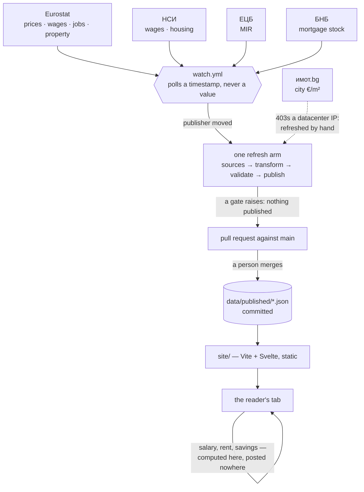

# Architecture

**Build-time data bake + static site.** A Python pipeline pulls official data,
gates it, and writes versioned JSON to `data/published/`. A static Svelte SPA
reads those files. The user's browser never calls Eurostat, НСИ, ЕЦБ, БНБ or
имот.bg, and nothing the user types leaves their device.



The reader's browser calls no upstream, and nothing they type leaves the device.
**A published figure reaches them through a merge and no other way** — §"What
happens to a data pull request" is why nothing here merges one.

## Repo map

| Directory | What is in it | Its own map |
|---|---|---|
| `pipeline/` | Python 3.11 ingest: `sources/*.py` → `transform.py` → `validate.py` → `publish.py`, driven by `cli.py`. Plus the dated legislative tables and the release calendar | [`pipeline/AGENTS.md`](../pipeline/AGENTS.md) |
| `data/published/` | The payloads, committed. These ARE what the site serves | §"What `data/published/` carries" below |
| `site/` | The Vite + Svelte SPA, five layers | [`site.md`](./site.md) §Layout, whose file tree `verify_docs_map.mjs` holds to the directory in both directions |
| `docs/` | Everything else | [`README.md`](./README.md) |
| `.github/` | `ci.yml`, `watch.yml`, one `refresh-*.yml` per arm, `freshness-check.yml`, the issue and PR templates | §CI below |

Root carries the licence pair that the rest of this repository keeps true:
`LICENSE` is Apache-2.0 over the code, `NOTICE` is the carve-out saying the
figures are not ours ([`legal.md`](./legal.md)).

**Only `site.md`'s tree lists files, and only because something checks it.** A
hand-kept list of filenames goes stale in the direction of omission, silently,
and a map naming something deleted reads as authoritative — so the one that
exists is guarded and there is not a second.

## Why bake at build time

| Concern | Baked JSON | Runtime API call |
|---|---|---|
| Upstream throttling | One fetch per refresh | One per visitor |
| Upstream downtime | Site unaffected | Site breaks |
| "As of" honesty | An `as_of` field in the payload | Cache headers and clock drift |
| Reviewability | The diff shows which numbers moved | Nobody sees a snapshot twice |
| Cold-cache latency | Instant | A round trip per upstream |

The trade: a bad upstream publish would produce a bad site until someone rolls
it back. The validation gates are the defence.

## Pipeline layers

Every layer has one job, and they do not overlap.

| Layer | Files | Job |
|---|---|---|
| Source | `sources/{eurostat,bnb,ecb,imot,nsi,dv}.py` | Call one upstream, prove the response is what was asked for, return flat rows. **No math.** |
| Transform | `transform.py` | Reshape rows into published shapes: year-end selection, the salary ladder. **No network, no validation.** |
| Validate | `validate.py`, `mortgage.py` | Gates that block the publish. A gate raises; it never repairs. Which gates run depends on the `--source` — [`validation-gates.md`](./validation-gates.md) §"Which gates run for which `--source`" is the table. |
| Publish | `publish.py` | Write the envelopes, including the provenance frame every payload carries. |
| CLI | `cli.py` | One arm per `--source`, and the exit codes. **No domain logic.** |
| Watch | `release_calendar.py`, `watch.py` | When each upstream publishes, and the poll that catches one. Reads a timestamp, never a value, and **imports nothing outside the standard library** — it runs before the pipeline is installed. |

Legislative constants have no machine-readable feed, so they live as dated
tables: `payroll.py#BG_PAYROLL_TABLE` (BG payroll law) and
`mortgage.py#BNB_LENDING_LIMITS` (БНБ borrower-based measures). Append a new
dated entry; never mutate one.

Every module that decides something has a test file named after it under
`pipeline/tests/`. `clock.py` is the exception and stays one: it is a single
`today()` returning the date in `Europe/Sofia`, called where a run needs the
date it is dated by, and
the suites that care about the date call it rather than assert on it. Alongside
those sit the suites named after an output rather than a module
(`test_salary_dist.py`, `test_published_contracts.py`,
`test_readme_contract.py`), and `test_live_upstreams.py`, which runs only under
`pytest -m live` and probes the real endpoints.

## What `data/published/` carries

Thirteen envelopes, all committed.

**Five fields are on every one of them**: `schema_version`, `as_of`, `source`,
`source_url`, `notes`. That is the provenance floor — where the figure came
from, when, and what was done to it.

The rest of the frame is carried where it means something rather than
everywhere. `dataset` names the upstream file and the coordinates read out of
it, and appears wherever a payload has a fixed set to name — both НСИ wage
payloads name two files each, because both language editions are read and each
pins the other. A payload drawing on several cubes records provenance per row,
per tier or per block instead. `payload_name`, `ref_period`, `published_at`,
`unit` and `value` follow the same rule, and `methodology_change`,
`is_preliminary` / `disclaimer` appear only where they apply. A single-figure
payload carries most of the frame; a composite one carries it one level down.

`is_preliminary` is the newest of these and the one to copy from: it is `null`
where a publisher draws no such distinction, which is a different claim from
`false`. Only НСИ mark a release provisional, so it is a boolean only on theirs
and `null` everywhere else.

| File | Carries |
|---|---|
| `hicp_categories.json` (90 KB) | 13 ECOICOP ver.2 divisions + ~46 groups; per code `weight_pct`, `annual_rate_pct`, `index_by_year` (year-end, back to `INDEX_SINCE_YEAR`), `latest_index`, BG/EN labels, two verify URLs |
| `hicp_headline.json` | Eurostat's all-items 12-month rate, verbatim, with its reference month |
| `salary_dist.json` | An 11-point gross ladder P1…P99 inside a `shape` block carrying Eurostat SES's own provenance. The НСИ level the ladder is re-set to is **not** copied in here — the SPA reads it from `sector_salary.json`'s all-activities row, so no payload carries a second publisher's figures |
| `payroll.json` | The dated BG payroll-law table + `scheduled_changes` |
| `region_salary.json` (25 KB) | НСИ's published quarterly gross wage for each of the 28 области, with their own name for it in both languages; each row's headline is their latest quarter. Keyed by `code`, which is the join to `city_price.json` |
| `sector_salary.json` (19 KB) | НСИ's published quarterly gross wage by economic activity — 19 NACE Rev 2 sections plus the all-activities total, each with `en_name`, `bg_name` (both НСИ's own, from their two language editions), `value_eur` and the full quarterly series. **An average, and the country's**, where `region_salary` is per област: nobody publishes a distribution by activity for BG, so there is no median and no rank in here to read |
| `city_price.json` | Per-city €/m² for the 27 cities имот.bg cover: each city's district count, summary and its OWN year window, chosen from how far back имот.bg's coverage of it supports a comparison. Keyed by the same `code`. No per-district dict — nothing read it |
| `mortgage.json` (28 KB) | Two rate tiers (`new_business` with nested `aprc`, `outstanding_stock`), the БНБ↔ЕЦБ `cross_check`, `lending_limits`, the `fixation` split over four initial-fixation buckets and the `new_business_split` between pure new lending and renegotiation |
| `credit.json` | What the same household pays on everything that is not a home — consumer credit with its ГПР, overdrafts, credit-card balances carried past the interest-free period — and the two deposit series that are the comparator |
| `unemployment.json` | BG unemployment — **monthly**, seasonally adjusted, the cube's whole series (`une_rt_m`, not the annual `une_rt_a`), with Eurostat's own break flags in `status_by_period` |
| `house_market.json` (40 KB) | The quarterly transaction market: `deals` and `value` (how many dwellings households bought and what they paid), `avg_deal_eur`, and `price_index` beside `price_index_real` — the nominal series and the same series deflated, so a rise in prices is never reported as a rise in what a home costs in real terms |
| `house_market_structure.json` | `tenure`, `census_dwellings` and `housing_cost_overburden` — what the country owns rather than rents, the census dwelling stock, and the share spending over 40% of income on housing. Annual, so it moves on a different clock from the quarterly market above and carries its own `ref_period` |
| `nsi_housing.json` (20 KB) | НСИ's own housing series: `national_price_index_yoy`, `city_price_index_yoy` for the six cities over 120,000, and `city_deals_yoy`. **Percentages, never a level** — no НСИ city series carries €/m², which is why `/market/` compares change against change and the € level comes from `city_price.json` |

Field-level detail sits beside the connector that produces it, in
[`data-sources.md`](./data-sources.md). The load-bearing schema rule is in
[`math.md`](./math.md): **every index field carries Eurostat's own value, on
the base `index_base_year` names**, because the SPA divides
`latest_index / index_by_year[anchor]` and the two have to share a base.

## The five layers in the SPA

```
data/published/*.json
   │
   ▼  data.js     WHICH published number, and what if it is missing
   │              (the fallback chains, relabelling as they degrade)
   ▼  view/*.js   WHICH inputs go into which formula
   │              (freshness.js#dataAge, results.js#headlineRate,
   │               home.js#mortgagePanel, basket.js#verifyUrl, …)
   ▼  mirror.js   THE ARITHMETIC
   │              (annuityPayment, personalInflation, pocketReal, …)
   ▼  calculator.svelte.js
   │              WHAT HOLDS IT — the $state the reader types into and the
   │              $derived graph over the three layers above. No arithmetic.
   ▼  components/ WHERE it goes, what colour, which language
```

The rule this split encodes: **where a wrong wiring would be a wrong number,
make the wrong wiring impossible to express.** `savingsSince2020` takes the
categories rather than a rate; `headlineRate` takes only the headline payload;
`mortgagePanel` reads the regulatory caps out of the published limits instead
of accepting them as arguments. Details in [`site.md`](./site.md).

## Module ownership

| Module | Owns |
|---|---|
| `sources/*.py` | Talking to one upstream, and proving the response is the one requested |
| `transform.py` | Reshaping upstream rows into published shapes |
| `validate.py` | The numbered HICP gates, plus a payload gate per family — region salary, city price, house market, НСИ housing, sector wage — each running only under its own `--source` |
| `mortgage.py` / `payroll.py` | The dated legislative tables and the mortgage gates |
| `publish.py` | The envelopes and the provenance frame |
| `cli.py` | One arm per `--source`; exit codes **2** transform, **3** gate, **4** network |
| `site/src/lib/payloads.js` | Which payloads the page depends on, and which routes need each — the one list `loadAll`, the freshness verdict, `/version.json` and the sitemap all derive from |
| `site/src/lib/data.js` | Which published number, including every fallback chain |
| `site/src/lib/view/` | Which input feeds which formula — one module per subject, each paired with the suite of the same stem |
| `site/src/lib/mirror.js` | The arithmetic — the only domain math in the front end |

## Hosting and headers

The build output is a static directory, so everything the edge needs lives in
`site/public/_headers` — the CSP, the cache lifetimes and the
`Permissions-Policy`. **It is the declaration, and applying it is the
deployment's job.** [`site.md`](./site.md) §"Hosting: `public/_headers`" carries
what each directive is holding and why `make headers` sits outside `make check`.

**Credentials the deployment needs are the deployment's business, not this
repository's.** Whatever publishes the built site, and whatever runs the refresh
on a schedule, will hold something — a key, a token, a login. None of it belongs
in the tree, and this repository deliberately describes no particular hosting
arrangement, so there is nothing here to keep in step with one. What does bind:
generate a credential where it will be used rather than carrying it there, scope
it to the one thing it needs, and assume anything ever committed is permanent.

## CI

`.github/workflows/ci.yml` runs on every push to every branch, on every pull
request, and on demand. Its jobs are `pipeline` (pytest, offline), `site` (the
module suites, the build and the built page in a browser), `windows` (the same
run on `windows-latest`, so the Makefile-free path stays true), `authorship`
(the commit author is a person, not an agent) and `data` (every published
payload is committed and parses). Each reports its own suite count against the
floor it has to clear.

The two triggers cover different things. A push gates a branch before the merge
and re-checks `main` after it. A pull request is what reaches a **fork** at
all — a fork's commits never touch this repository's refs, so no push event
fires here and no check would ever be created against that SHA. It also builds
`refs/pull/N/merge` rather than the head, which is the one tree no push ever
sees: a branch and `main` can each be green and their merge broken. A same-repo
pull request therefore runs twice, and the second run is not a duplicate of the
first.

It does **not** refresh data — the refresh workflows are separate files with
separate triggers, and this one holds no upstream credential and no schedule.
Every arm but one lives in `.github/workflows/refresh-*.yml` and opens a pull
request against `main` so the diff stays the review. The
exception is `city-price`: `имот.bg` answers a datacenter IP with a 403, no
runner has an ordinary Bulgarian connection to offer it, and it is refreshed by
hand for that reason and no other. A refresh that runs
anywhere still has to be given what the network there lacks: the БНБ arm needs
the missing TLS intermediate supplied before it can fetch at all
(`sources/bnb.md` §"TLS setup"). The `live` probes stay excluded from CI for
the same reason they always were: run them from an ordinary network with
`pytest -m live`.

### What starts a refresh

**`watch.yml`, within about twenty minutes of the upstream publishing.** A cron
cannot be both safe and early on publishers who do not fix their day a month
ahead, so the watcher polls a cheap marker per cube or file — a timestamp, never
data — inside the window `release_calendar.py` records for it, and dispatches
the arm whose publisher has moved since that arm last ran. A tick costs about
fifteen seconds: `watch.py` is stdlib-only and runs before anything is
installed. `docs/data-sources.md` §"When each upstream publishes" is the table
and the evidence behind it, and `release_calendar.WATCH_CRON` is why the poll
line is a ceiling rather than a rate — GitHub drop most of what a denser one
asks for.

A run that went red still READ its upstream, so it would otherwise take the
release it died on off the watcher's list for good. `watch.py#clock_of` holds
the clock at the last green run for three ticks instead, which re-dispatches an
arm that was unlucky without re-dispatching one that is broken.

The cron each arm still carries is the backstop for the watcher being broken.
It fires once that arm's window has closed, which is the last hour at which
running unconditionally is right, and `payroll` is the one arm where the cron
is the whole schedule — its trigger is a statutory boundary in Sofia rather
than an upstream anybody can poll.

### What happens to a data pull request

Every refresh arm but `city-price` pushes `data/<source>` and
opens a pull request against `main` — **when the upstream republished, and at no
other time.** A run that re-reads the same figures on a later day writes the same
payload with a later date on it, and `refresh_report.py` is what tells those two
apart: it drops the fields the pipeline stamps with the run date, at every depth,
and compares the rest against what is committed. A pull request that moves no
number spends the one human look below on nothing.

**A published figure reaches a reader
through a merge and no other way**, and nothing in this repository merges one.
That is deliberate, and the failure it leaves is the one worth naming: left
alone the site ages while every gate stays green — the refresh ran, the gates
passed, the PR opened, the dispatched CI went green on it — and the only signal
a reader would ever get is the overdue line on a page they may never open.

**Auto-merge on green is refused.** A data refresh is precisely the change where
the diff IS the review: a number moving is the whole event, `data/published/` is
committed so the diff shows which ones moved, and a bot merging it removes the
only human look any published figure gets. The gates are not a substitute — they
catch a payload that is wrong in a way somebody already thought of, which is a
narrower claim than "this is the right number this quarter".
`freshness-check.yml` therefore takes `pull-requests: read` and
`test_cli_dispatch.py` asserts it never takes write.

**The enforcement is that the weekly check fails loudly, naming the pull
request.** `freshness-check.yml` reports two things in one run: payloads past
**the cadence their own manifest row declares** — it shells out to
`payload-cadence.mjs` for that, so one flat threshold cannot creep back in — and
open `data/*` pull requests with how long each has been sitting.
Both halves always run and one exit code covers them, because a payload is
usually stale *because* its refresh is waiting in an unmerged PR — a check that
exited on the staleness would hide the reason for it on exactly the weeks it
mattered. Seven days is the pull-request line: this check runs weekly, so a PR
that was open the last time it ran has been passed over rather than merely not
looked at yet.

Naming an assignee was the other candidate and it is not implementable here
without inventing a fact: the owner is an organisation rather than a user, so
there is no account this repository can name as the reviewer without asserting
something about a person it does not know.

**The workflow uses no secrets**, with `permissions: contents: read`. Because it
does not refresh data it holds no upstream credential, and that is what lets a
pull request from a stranger run the full suite. Keep it that way — the refresh
workflows write, and this one must not: they take `contents: write` to push a
`data/<source>` branch and `actions: write` to start this workflow against it,
which is a token a fork's code must never run under.

That property is also what makes the `pull_request` trigger safe to have. It
runs **this** repository's copy of the workflow against the merge ref with a
read-only token, so a fork controls the code under test and nothing else.
`pull_request_target` is the trigger that would hand a fork a writable token and
whatever secrets the repository holds; it is not used here and there is nothing
it could be used for. Every checkout also sets `persist-credentials: false`, so
the run's own token is not left in `.git/config` for a later step to read.

## Cross-references

- [`site.md`](./site.md) — the SPA module by module
- [`data-sources.md`](./data-sources.md) — every upstream endpoint and its quirks
- [`math.md`](./math.md) — where every number comes from
- [`validation-gates.md`](./validation-gates.md) — what blocks a publish
- [`local-development.md`](./local-development.md) — how to run it
